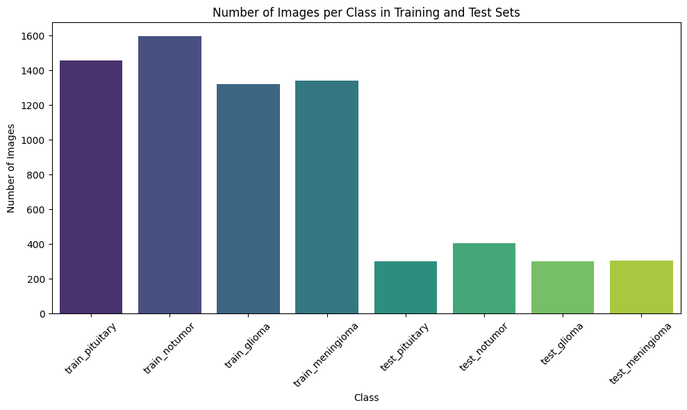
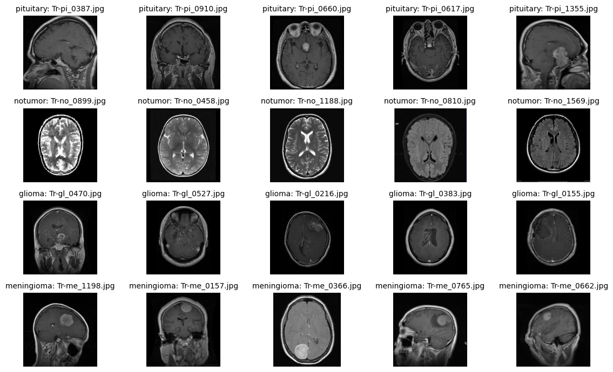
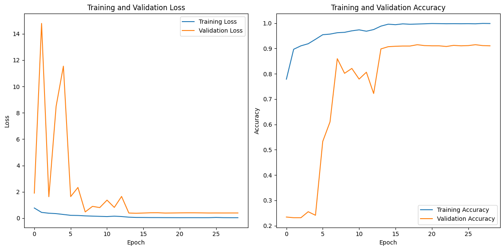
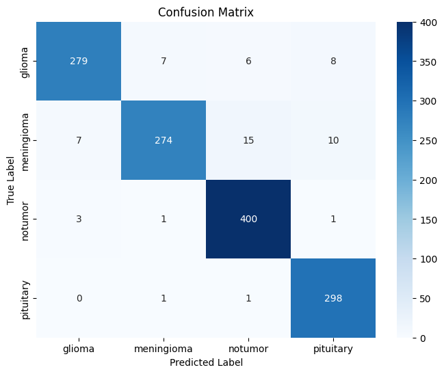
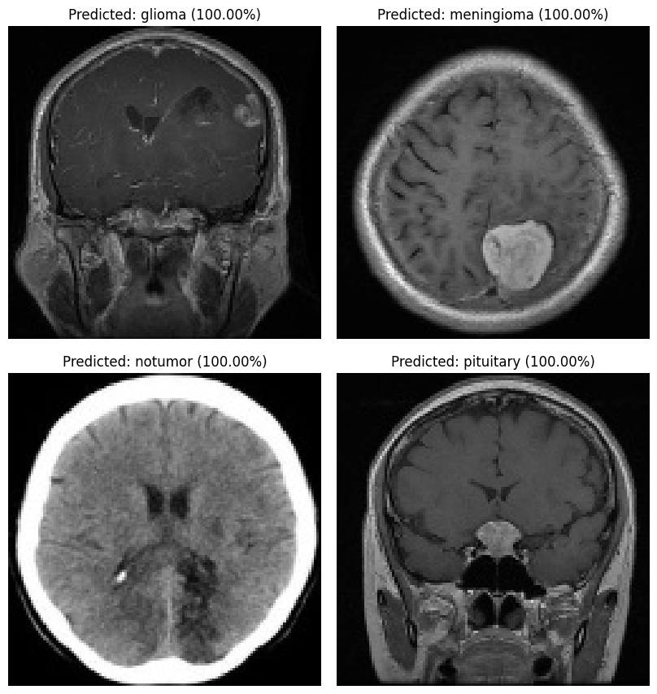

# 🧠 Brain Tumor MRI Classification

> Deep learning project for classifying brain MRI images into **glioma, meningioma, pituitary, and no tumor** using image preprocessing and **ResNet50 transfer learning**.


## 📌 Project Overview

Brain MRI analysis can be time-consuming and requires specialized expertise. This project explores a deep learning pipeline that automatically classifies MRI images into four categories.

### Classes

- **Glioma**
- **Meningioma**
- **Pituitary**
- **No Tumor**

The project includes dataset exploration, image preprocessing, augmentation, transfer learning, evaluation, and sample predictions.

> ⚠️ **Medical disclaimer:** This project is an educational/research machine-learning experiment. It is **not a clinical diagnostic system** and should not be used for diagnosis or treatment decisions.

---

## 📊 Dataset

The project uses the **Brain Tumor MRI Dataset** from Kaggle.

| Split | Images |
|---|---:|
| Training | 5,712 |
| Testing | 1,321 |
| Total | 7,033 |

The original dataset contains four classes: `glioma`, `meningioma`, `pituitary`, and `notumor`.

### Dataset distribution



---

## 🔧 Preprocessing Pipeline

The images go through the following steps:

1. Convert MRI images to grayscale.
2. Detect and crop the brain region using contour detection.
3. Resize images to **124 × 124** pixels.
4. Normalize pixel values.
5. Repeat the grayscale channel three times to create 3-channel images for ImageNet-pretrained ResNet50.
6. Apply light image augmentation during training.

### Example MRI samples



---

## 🤖 Model Architecture

The final experiment uses **ResNet50 pretrained on ImageNet** as the convolutional feature extractor, followed by a custom classification head:

```text
MRI Image
   ↓
Preprocessing
   ↓
ResNet50 (ImageNet weights)
   ↓
Global Average Pooling
   ↓
Dropout (0.5)
   ↓
Dense Layer (64, ReLU + L2 regularization)
   ↓
Dropout (0.5)
   ↓
Softmax Output (4 classes)
```

### Training configuration

- Image size: `124 × 124`
- Batch size: `32`
- Maximum epochs: `60`
- Optimizer: `Adam`
- Learning rate: `0.001`
- Loss: `Categorical Cross-Entropy`
- Early stopping
- Learning-rate reduction on plateau

---

## 📈 Results

The recorded final ResNet50 test run achieved approximately **95% accuracy** on **1,311 test images**.

| Metric | Result |
|---|---:|
| Accuracy | ~95.4% |
| Weighted Precision | ~95.5% |
| Weighted Recall | ~95.4% |
| Weighted F1-score | ~95.4% |

### Training curves



### Confusion matrix



The confusion matrix shows the distribution of correct and incorrect predictions across the four classes.

---

## 🔍 Sample Predictions

The original project run produced correct predictions for representative samples from all four classes.



Individual prediction outputs are also available:

- `results/prediction_glioma.png`
- `results/prediction_meningioma.png`
- `results/prediction_notumor.png`
- `results/prediction_pituitary.png`

---

## 📁 Repository Structure

```text
brain-tumor-mri-classification/
│
├── brain_tumor_mri_classification.ipynb   # Clean, GitHub-ready notebook
├── app.py                                  # Optional Flask inference API
├── requirements.txt                        # Python dependencies
├── .gitignore                              # Files excluded from Git
├── README.md                               # Project documentation
│
└── results/
    ├── sample_mri_images.png
    ├── class_distribution.png
    ├── training_history.png
    ├── confusion_matrix.png
    ├── sample_predictions.png
    ├── prediction_glioma.png
    ├── prediction_meningioma.png
    ├── prediction_notumor.png
    └── prediction_pituitary.png
```

---

## 🚀 How to Run

### 1. Clone the repository

```bash
git clone <YOUR_GITHUB_REPOSITORY_URL>
cd brain-tumor-mri-classification
```

### 2. Install dependencies

```bash
pip install -r requirements.txt
```

### 3. Download the dataset

Download the Brain Tumor MRI Dataset from Kaggle and place it so the folder structure matches the notebook.

### 4. Run the notebook

Open:

```text
brain_tumor_mri_classification.ipynb
```

The notebook can be run in Google Colab or another environment with TensorFlow support. Update `DATA_DIR` if necessary.

### 5. Save the trained model

The notebook saves the trained model as:

```text
brain_tumor_resnet50.keras
```

Because trained model files can be large, it is recommended to use **Git LFS, GitHub Releases, or another artifact store** instead of committing large binaries directly to the repository.

---

## 🌐 Optional Flask API

`app.py` provides a simple `/predict` endpoint for running inference with a saved Keras model.

Example request:

```bash
curl -X POST -F "file=@sample.jpg" http://127.0.0.1:5000/predict
```

Example response:

```json
{
  "predicted_class": "glioma",
  "confidence": 0.98,
  "probabilities": {
    "glioma": 0.98,
    "meningioma": 0.01,
    "notumor": 0.00,
    "pituitary": 0.01
  }
}
```

The API is intended for demonstration and research purposes only.

---

## 🛡️ Security & Privacy

No API keys, Kaggle credentials, ngrok tokens, personal Windows file paths, or other private credentials are required in this repository.

**Never commit secrets to GitHub.** If a credential has previously been exposed, revoke/rotate it from the relevant service before publishing the repository.

---

## 💡 Future Improvements

- Compare additional transfer-learning architectures under the same evaluation protocol.
- Add Grad-CAM visual explanations.
- Add more robust data augmentation and class-balancing strategies.
- Package the inference interface as a Streamlit application.
- Track experiments and metrics systematically.
- Evaluate on an independent external dataset to study generalization.

---

## 👩‍💻 Project

**Brain Tumor MRI Classification — Graduation Project**

Built as a practical deep learning project covering computer vision, medical-image preprocessing, transfer learning, and model evaluation.
